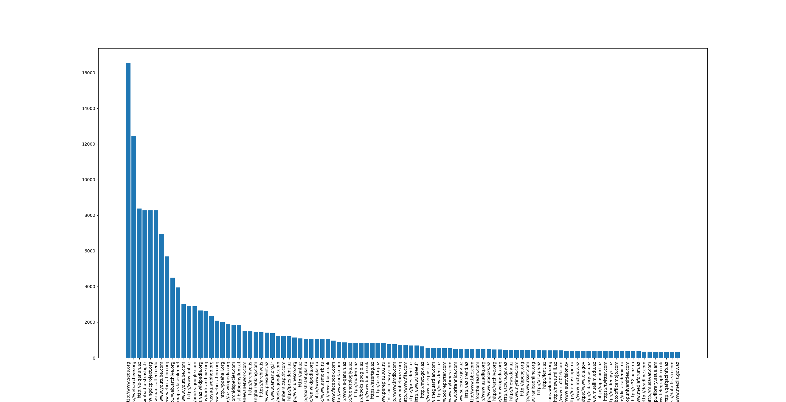
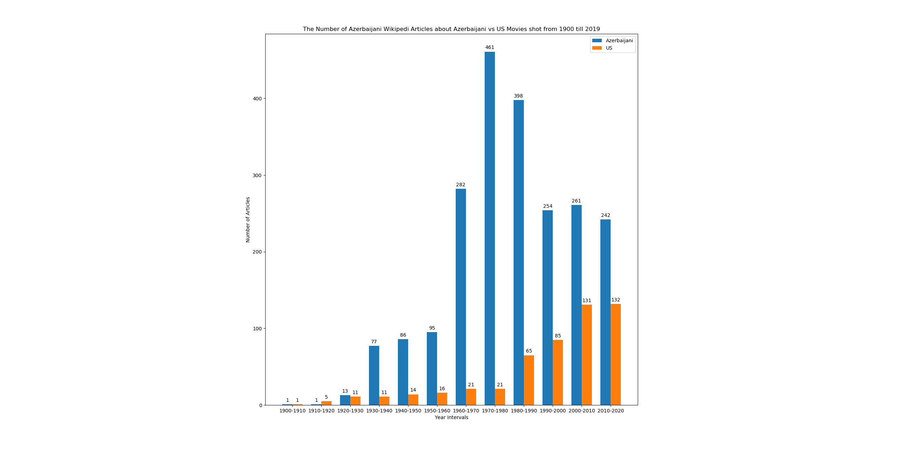
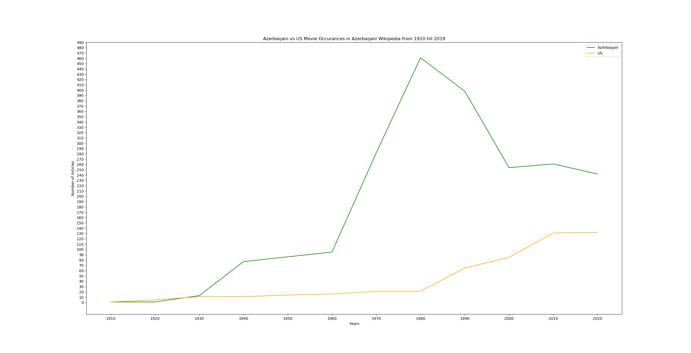
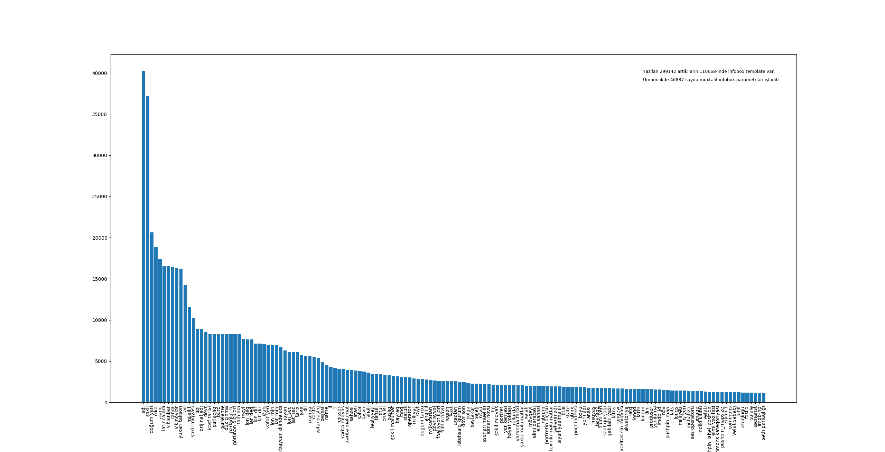

# Az-Wikipedia Parser and Analyzer
The project aims at cleaning, parsing and analysing Az Wikipedia.  The distribution of properties inside article templates, categories and most used external references outside Wikipedia have been analyzed. Templates in Az Wikipedia are mainly very obscure inside the body and not readly avaliable for analyisis. Manual heuristic based parsing code have been given for parsing templates.

## The Distribution of Top 150 External Links Present in AzWikipedia 

## The Number of Azerbaijani Wikipedi Articles about Azerbaijani vs US Movies shot from 1900 till 2019

## The Distribution of Top Properties encountered in Templates

